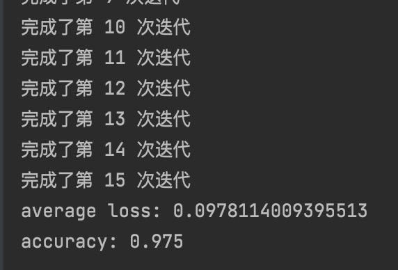
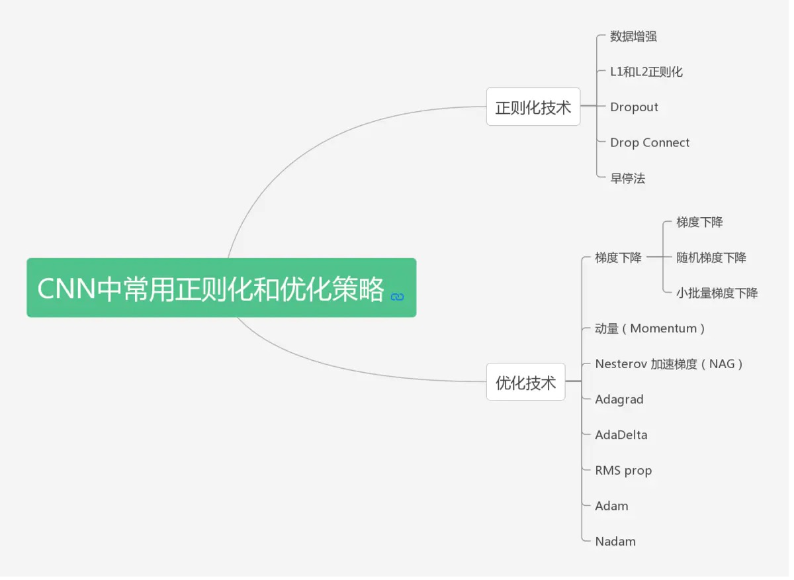
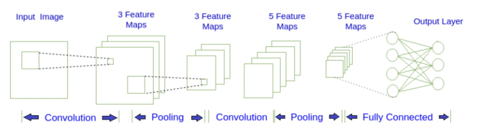
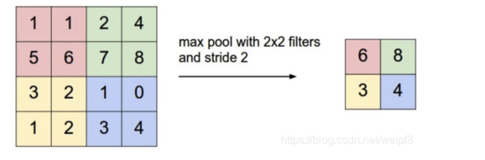

# 智能系统Lab1_part2实验文档

[TOC]

## 代码基本结构

这次lab的part2部分我是运用了pytorch里的模型，是基于LeNet实现的卷积神经网络

在model.py文件中搭建了一个**卷积层——ReLU层——池化层——卷积层——ReLU层——池化层——全连接线性层**的cnn神经网络，在train.py文件中调用这个网络并且加载数据进行训练与测试

**model.py**

在构造方法中进行网络的初始化，第一套conv即conv1设置为**卷积层——ReLU层——池化层**的结构，并且根据输入向量设置好层的各项参数，第二套conv即conv2只在卷积层参数稍有不同，输出化为（32， 7， 7），还是**卷积层——ReLU层——池化层**；最终网络输出还要经过一层**线性全连接层**，以化成一个12维的向量


pytorch中tensor（也就是输入输出层）的通道排序为：[batch, channel, height, width]

```python
import torch.nn as nn


class LeNet(nn.Module):
    def __init__(self):
        super(LeNet, self).__init__()
        self.conv1 = nn.Sequential(
            nn.Conv2d(in_channels=1,    # 输入特征矩阵的深度
                      out_channels=16,  # 输出特征矩阵的深度，也等于卷积核的个数
                      kernel_size=5,    # 卷积核的尺寸
                      stride=1,     # 卷积核的步长
                      padding=2),   # 补零操作
            nn.ReLU(),
            nn.MaxPool2d(kernel_size=2)  # 采用2*2采样
        )

        # 经过卷积后的输出层尺寸计算公式为(W - F + 2P) / S + 1

        self.conv2 = nn.Sequential(
            nn.Conv2d(16, 32, 5, 1, 2),
            nn.ReLU(),
            nn.MaxPool2d(2)
        )

        self.out = nn.Linear(32 * 7 * 7, 12)

    def forward(self, x):
        x = self.conv1(x)
        x = self.conv2(x)
        x = x.view(x.size(0), -1)
        output = self.out(x)
        return output

```


最初始的train.py文件的结构为：

**train.py**

使用DataLoader加载数据集，将训练集和测试集的图片数据转成tensor格式，并构建网络、定义优化器、损失函数

```python
import torch
import torchvision
from model import *
from torch.autograd import Variable
import torch.utils.data as data
import torchvision.datasets as dset
import matplotlib.pyplot as plt
import numpy as np
import torchvision.transforms as transforms

torch.manual_seed(1)

# 超参数
EPOCH = 20
BATCH_SIZE = 5
LR = 0.001

train_data = dset.ImageFolder('train', transform=transforms.Compose([
    transforms.Grayscale(1),  # 单通道
    transforms.ToTensor()  # 将图片数据转成tensor格式
]))
# 加载训练集，并将之转换为易操作的tensor数据
train_loader = data.DataLoader(dataset=train_data, batch_size=BATCH_SIZE, shuffle=True)

# 加载测试集，并将之转换为易操作的tensor数据
test_data = dset.ImageFolder('test', transform=transforms.Compose([
    transforms.Grayscale(1),  # 单通道
    transforms.ToTensor()  # 将图片数据转成tensor格式
]))
test_loader = data.DataLoader(dataset=test_data)

cnn = LeNet()
# 优化器
optimizer = torch.optim.Adam(cnn.parameters(), lr=LR)
loss_func = nn.CrossEntropyLoss()

for epoch in range(EPOCH):
    count = 0
    total_loss = 0
    for i, (train_x, train_y) in enumerate(train_loader):
        batch_x = Variable(train_x)
        batch_y = Variable(train_y)
        # 输入训练数据
        output = cnn(batch_x)

        loss = loss_func(output, batch_y)
        # 清空上一次梯度
        optimizer.zero_grad()
        # 误差反向传递
        loss.backward()
        # 优化器参数更新
        optimizer.step()
    print("完成了第", epoch + 1, "次迭代")

count = 0
total_loss = 0
for step, (test_x, test_y) in enumerate(test_loader):
    test_output = cnn(test_x)
    pred_y = torch.max(test_output, 1)[1].data.numpy().squeeze()

    batch_x = Variable(test_x)
    batch_y = Variable(test_y)
    output = cnn(batch_x)
    total_loss += loss_func(output, batch_y).item()
    index = torch.max(output, 1)[1].data.numpy().squeeze()
    if index == batch_y.item():
        count += 1

print("accuracy: " + str(count / len(test_data)))
```

实验结果为：



## 设计实验改进网络

深层网络架构的学习要求大量数据，对计算能力的要求很高。神经元和参数之间的大量连接需要通过梯度下降及其变体以迭代的方式不断调整。此外，有些架构可能因为强大的表征力而产生测试数据过拟合等现象。这时我们可以使用正则化和优化技术来解决这两个问题。

包括数据增强、L1正则化、L2正则化、Dropout、DropConnect和早停（Early stopping）法等



### 正则化技术

正则化技术是保证算法泛化能力等有效工具，正则化还是训练参数数量大于训练数据集的深度学习的关键模型，且可以避免算法过拟合（过拟合通常发生在算法学习的输入数据无法反应真实的分布且存在一些噪声的情况）

#### L1/2正则化

L1/L2正则化是最常用的正则化方法。L1正则化**向目标函数添加正则化项**，以减少参数的值的总和；而L2正则化中，添加正则化项的目的在于**减少参数的平方的总和**。根据之前的研究，L1 正则化中的很多参数向量是稀疏向量，因为很多模型导致参数趋近于 0，因此它常用于**特征选择设置**中。机器学习中最常用的正则化方法是对权重施加 L2 范数约束。

标准正则化代价函数如下：
$$
\theta = argmin\frac{1}{N}\sum_{i=1}^{N}{(L(y_i,y) + {\lambda}R(w))}
$$
其中正则化项R(ω)是：
$$
R_{L_2}(w)=||W||_2^2
$$
L1正则化：
$$
R_{L_1}(w)=\sum_{k = 1}^{Q}||W||_1
$$
L1 正则化在零点不可微，因此权重以趋近于零的常数因子增长。很多神经网络在权重衰减公式中使用一阶步骤来解决非凸 L1 正则化问题 。L1 范数的近似变体是：
$$
|W|_1=\sum_{k=1}^{Q}\sqrt{w_k^2+\varepsilon}
$$


##### L1正则化

在每次计算损失时并不是简单的调用CrossEntropyLoss()，而是加上额外的正则项再进行backpropagate：

```python
# 使用L1正则化
reg_loss = 0
for papam in cnn.parameters():
    reg_loss += torch.sum(torch.abs(papam))
classify_loss = loss_func(output, batch_y)
loss = classify_loss + 0.01 * reg_loss

```

| epoch | 采用L1正则化的准确率 | 不采用L1正则化的准确率 |
| ----- | -------------------- | ---------------------- |
| 8     | 0.865555             | 0.974444               |
| 10    | 0.887777             | 0.987777               |
| 12    | 0.87                 | 0.98                   |
| 15    | 0.878333             | 0.979                  |
| 20    | 0.896666             | 0.983888               |

通过实验可以得到以上结果

通过结果可以很明显地观察到，使用了L1正则化以后，准确率反而下降了。这也许是因为本次十二分类任务过于简单，网络结构简单参数不多，没有出现明显的过拟合现象。所以没有采用这一策略


##### L2正则化

在本次lab中，使用L2正则化就在设置优化器时给它设置参数weight_decay即可：

```python
#使用L2正则化
optimizer = torch.optim.Adam(cnn.parameters(), lr=LR, weight_decay=0.01)
```

经过实验可得以下数据：

| epoch | 采用L2正则化的准确率 | 不采用L2正则化的准确率 |
| ----- | -------------------- | ---------------------- |
| 8     | 0.9594444/0.972222   | 0.974444               |
| 10    | 0.9383333/0.974444   | 0.987777               |
| 12    | 0.9472222/0.98222    | 0.98                   |
| 15    | 0.9527777/0.979444   | 0.979                  |
| 20    | 0.9633333/0.976666   | 0.983888               |

可以看出weight_decay取1e-5时，准确率对比不采用L2正则化要稍高一点

### Dropout

Bagging 是通过结合多个模型降低泛化误差的技术，主要的做法是分别训练几个不同的模型，然后让所有模型表决测试样例的输出。而 Dropout 可以被认为是集成了大量深层神经网络的 Bagging 方法，因此它提供了一种廉价的 Bagging 集成近似方法，能够训练和评估值数据数量的神经网络。

Dropout 指暂时丢弃一部分神经元及其连接。随机丢弃神经元可以防止过拟合，同时指数级、高效地连接不同网络架构。神经元被丢弃的概率为 1 − p，减少神经元之间的共适应。隐藏层通常以 0.5 的概率丢弃神经元。使用完整网络（每个节点的输出权重为 p）对所有 2^n 个 dropout 神经元的样本平均值进行近似计算。Dropout 显著降低了过拟合，同时通过避免在训练数据上的训练节点提高了算法的学习速度。

构建cnn网络时在全连接层之前加入一个Dropout层

```python
nn.Dropout()#drop out
```

| epoch | 采用Dropout的准确率 | 不采用Dropout的准确率 |
| ----- | ------------------- | --------------------- |
| 8     | 0.972222            | 0.974444              |
| 10    | 0.9688889           | 0.987777              |
| 12    | 0.9783333           | 0.98                  |
| 15    | 0.975               | 0.979                 |
| 20    | 0.9794              | 0.983888              |

### 早停法

每完成一次epoch，就将这一次的准确率和上一次epoch的准确率进行对比，当发现准确率下降时就马上停止训练，这样可以达到防止过拟合的目的


### 不同的优化函数

我尝试了随机梯度下降和小批量梯度下降等多种不同的优化函数，在其他条件均相同的情况下，epoch取20将其对比，发现准确率没有明显的差别

```python
optimizer = torch.optim.Adam(cnn.parameters(), lr=LR, weight_decay=1e-5)#L2正则化

optimizer = torch.optim.SGD(cnn.parameters(), lr = LR)#随机梯度下降

optimizer = torch.optim.ASGD(params, lr=0.01, lambd=0.0001, alpha=0.75, t0=1000000.0, weight_decay=0)#平均随机梯度下降算法

optimizer = torch.optim.Adagrad(params, lr=0.01, lr_decay=0, weight_decay=0)#AdaGrad算法

optimizer = torch.optim.Adadelta(params, lr=1.0, rho=0.9, eps=1e-06, weight_decay=0)#自适应学习率调整 Adadelta算法

optimizer = torch.optim.RMSprop(params, lr=0.01, alpha=0.99, eps=1e-08, weight_decay=0, momentum=0, centered=False)#RMSprop算法

optimizer = torch.optim.Adamax(params, lr=0.002, betas=(0.9, 0.999), eps=1e-08, weight_decay=0)#Adamax算法（Adamd的无穷范数变种

optimizer = torch.optim.SparseAdam(params, lr=0.001, betas=(0.9, 0.999), eps=1e-08)#SparseAdam算法

optimizer = torch.optim.LBFGS(params, lr=1, max_iter=20, max_eval=None, tolerance_grad=1e-05, tolerance_change=1e-09, history_size=100, line_search_fn=None)#L-BFGS算法

optimizer = torch.optim.Rprop(params, lr=0.01, etas=(0.5, 1.2), step_sizes=(1e-06, 50))#弹性反向传播算法
```


### Batch Normalization

构建cnn网络时在卷积层后又加入一个BatchNorm2d层

```python
nn.BatchNorm2d(16),#batch normalization
```

| epoch | 采用Batch Normalization后的准确率 | 不采用Batch Normalization的准确率 |
| ----- | --------------------------------- | --------------------------------- |
| 8     | 0.9661111                         | 0.974444                          |
| 10    | 0.9711111                         | 0.987777                          |
| 12    | 0.9816666                         | 0.98                              |
| 15    | 0.9833333                         | 0.979                             |
| 20    | 0.9877777                         | 0.983888                          |


## 对网络设计的理解

### CNN结构介绍



上面是一个简单的CNN结构图，第一层输入图片，进行卷积操作（Convolution）操作，得到第二层深度为3 的特征图（feature map）。对第二层的特征图进行池化（pooling）操作，得到第三层深度为3的特征图。重复上述操作得到第五层深度为5的特征图，最后将这5个特征图，也就是5个矩阵，按行展开连接成向量，传入全连接（full connected）层，全连接层就是一个BP神经网络，图中的每个特征图都可以看成是排列成矩阵形式的神经元, 与 BP神经网络中的神经元大同小异. 下面是卷积和池化的计算过程.

#### **卷积**

对于一张输入图片，将其转化为矩阵，矩阵的元素为对应的像素值。假设有一个5*5的图像，使用一个3*3的卷积核进行卷积，可得到一个3*3的特征图。卷积核也称为滤波器（Filter）.卷积核在输入矩阵中滑动, 每滑动到一个位置, 将对应数字相乘并求和, 得到一个特征图矩阵的元素. 注意到, 动图中卷积核每次滑动了一个单位, 实际上滑动的幅度可以根据需要进行调整. 如果滑动步幅大于 1, 则卷积核有可能无法恰好滑到边缘, 针对这种情况, 可在矩阵最外层补零

一般情况下, 输入的图片矩阵以及后面的卷积核, 特征图矩阵都是方阵, 这里设输入矩阵大小为 w ww, 卷积核大小为 k kk, 步幅为 s ss, 补零层数为 p pp, 则卷积后产生的特征图大小计算公式为:
$$
w^{'} = \frac{w+2p-k}{s} + 1
$$
以上是对一个特征图采用一个卷积核卷积的过程, 为了提取更多的特征, 可以采用多个卷积核分别进行卷积, 这样便可以得到多个特征图. 有时, 对于一张三通道彩色图片, 或者如第三层特征图所示, 输入的是一组矩阵, 这时卷积核也不再是一层的, 而要变成相应的深度.

#### 池化

池化又叫下采样(Dwon sampling), 与之相对的是上采样(Up sampling). 卷积得到的特征图一般需要一个池化层以降低数据量. 池化的操作如下图所示:



和卷积一样, 池化也有一个滑动的核, 可以称之为滑动窗口, 上图中滑动窗口的大小为 2 × 2 2\times 22×2, 步幅为 2 22, 每滑动到一个区域, 则取最大值作为输出, 这样的操作称为 Max Pooling. 还可以采用输出均值的方式, 称为 Mean Pooling.

#### 全连接

经过若干层的卷积, 池化操作后, 将得到的特征图依次按行展开, 连接成向量, 输入全连接网络.

### CNN与BP之间的比较

**参数数量太多**。全连接的神经网络，在上一层所有节点和下一层所有节点之间，都有连接，导致参数数量会以每层节点数量的积的形式增长，这对于图片分类来说，实在过于庞大，因为每张图片都会有几百个像素点甚至更多的输入。CNN通过局部连接的卷积、同一个局部使用相同的参数、pooling解决了这一点。

**没有利用像素之间的位置信息。**在全连接神经网络中似乎同一层的每个节点都是对等的——因为他们无差别的连接着上一层和下一层的所有节点，但是对于图像来讲通常一个像素点与它周围的像素点关系紧密，CNN通过局部连接的卷积形式解决了这一点。

**网络层数限制。**全连接神经网络由于梯度下降法的限制，层数很难很多，因为存在梯度消失的问题，而CNN则通过多重手段例如ReLU解决了这一问题。