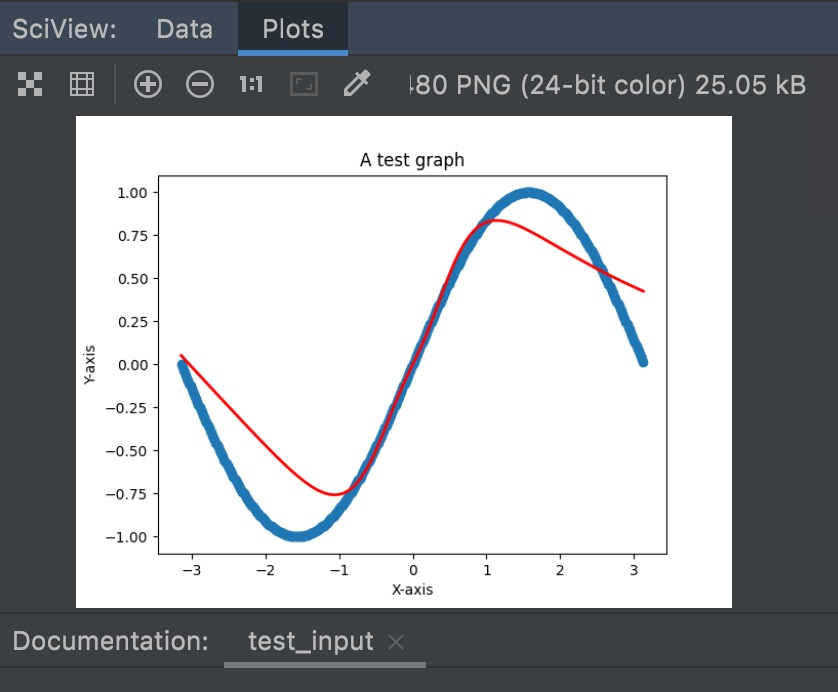
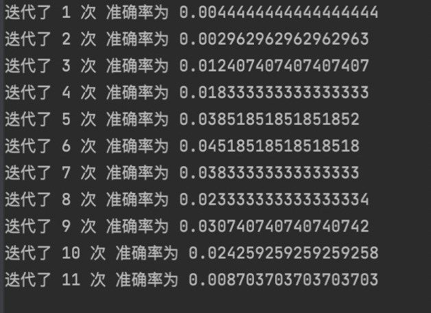

# 智能系统原理与开发Lab1实验报告

19302010081  夏梦洁

[TOC]

## 代码基本架构

在本次part1反向传播的lab中，我用的是python的面向对象来实现。基本思路是用了三个类来模拟神经网络。分别是用于代表单个神经元的Neuron类，代表每层神经元的Layer类以及代表整个神经网络结构的Network类。基本实现架构如下

### Neuron类

神经元类中的参数包括，每个神经元的**权重weight**（是一个1 * n的二维矩阵，n取决于该神经元所在层的左层有多少个神经元），神经元**权重的个数weigh_size**；神经元的**偏移量bias**（初始值为-1到0之间的一个随机数）；每个神经元对应的**输入input**与**输出output**，以及**delta**(反向传播时需要迭代计算的量)

该类中还包括其他一些方法，比如说激活函数sigmoid()，以及激活函数的导函数derivatives()，还有每个神经元使用激活函数正向传播的函数forward()。

> 这里我最后使用的激活函数并不是sigmoid,为了提高准确率选择了其他的激活函数，后面在分析网络参数的的实验比较的内容中会提到

```python
# 定义神经元类
class Neuron:

    def __init__(self, weight_size):
        self.weight_size = weight_size
        self.params = {'weight': np.random.random((1, weight_size)),  # 神经元的权重
                       'bias': -random.random(),  # 神经元的偏移量
                       'input': 0,  # 神经元记录的输入
                       'output': 0,  # 神经元记录的输出
                       'delta': 0
                       }

    def sigmoid(self, x_):
        return math.tanh(x_)
        # return 1.0 / (1.0 + np.exp(-x_))

    # 正向传播
    def forward(self):
        input = self.params['input']
        self.params['output'] = self.sigmoid(input)

    def derivatives(self):
        output = self.params['output']
        # return output * (1 - output)
        return 1 - output ** 2
```

### Layer类

Layer类用于组织同层的神经元，其中的参数包括层中**神经元的个数neuron_number**，该层所对应的**左层layer_left**（通过这种方式让层与层之间联系起来），每层中所有的**神经元列表neurons**。

其中主要的方法包括，**构造方法**（根据传入的神经元个数和左层，循环地构建起该层的神经元），以及用于正向传播的函数**forward()**,和反向传播时调整相应参数的函数**backward()**。

当进行正向传播forward时，该层所有的神经元的权重与左层的输出相点乘，得到了本层神经元的输入，再调用神经元自身的激活函数得到该层神经元的输出；当反向传播backward时，使用右边一层所有节点的delta和由于sigmoid带来的导数项（输出层除外），配合上本层的节点输出来设置权重的变化量。

```python
# Layer类组织同层的神经元
class Layer:

    def __init__(self, neuron_number, layer_left):
        self.neuron_number = neuron_number  # 每层有的神经元个数
        self.layer_left = layer_left  # 该层的左层，可以为空
        self.neurons = []  # 每层的神经元列表
        # 这个for循环用于构建起每层的神经元
        for i in range(0, neuron_number):
            # 如果该层不是最左层，那么该层每个神经元的weight_size应该等于它左层的神经元个数
            if self.layer_left is not None:
                n = Neuron(self.layer_left.neuron_number)
            # 如果该层是最左层，该层的神经元是没有权重的
            else:
                n = Neuron(0)
            self.neurons.append(n)
        # 同时设置此层的左层的右层为此层
        if self.layer_left is not None:
            self.layer_left.layer_right = self

    def forward(self):
        left = self.layer_left
        for neuron in self.neurons:
            temp = 0
            weight = neuron.params['weight']
            bias = neuron.params['bias']
            for i in range(0, left.neuron_number):
                temp += left.neurons[i].params['output'] * weight[0][i]
            temp += bias

            neuron.params['input'] = temp
            neuron.forward()

    def backward(self):
        for i in range(0, self.neuron_number):
            temp = 0
            for j in range(0, self.layer_right.neuron_number):
                neuron = self.layer_right.neurons[j]
                delta = neuron.params['delta']
                weight = neuron.params['weight']
                temp += delta * neuron.derivatives() * weight[0][i]
            self.neurons[i].params['delta'] = temp

        for i in range(0, self.neuron_number):
            neuron = self.neurons[i]
            left = self.layer_left
            delta = neuron.params['delta']
            for j in range(0, neuron.weight_size):
                output = left.neurons[j].params['output']
                self.neurons[i].params['weight'][0][j] += output * neuron.derivatives() * delta * Network.w_learning_rate
            self.neurons[i].params['bias'] += self.neurons[i].derivatives() * delta * Network.b_learning_rate


```

### Network类

Network类中有两个很重要的参数，**w_learning_rate**和**b_learning_rate**分别对应着delta w 和 delta b的学习率，这里设置两个学习率主要是为了方便调参，使训练出的模型更加准确。

构造方法用于一层一层地构造神经网络，**forward()**和**backward()**还是对应着正向传播和反向传播，一层一层地将输入层的向输出层forward(),从输出层向输入层backward()。**train_x**方法用于进行模型的训练，传入的两个参数：inputs为输入，outputs为理想的输出。test_x用于测试模型的训练结果，并且返回训练的结果。

```python
class Network:
    w_learning_rate = 0.005
    b_learning_rate = 0.005

    def __init__(self, nums):
        self.nums = nums    # nums是一个int的list nums的length代表着层数 nums的数值代表着每层所有的神经元个数
        self.layers = []    # 网络所拥有的所有层
        # 首先，构造第一层（因为第一层没有左边层）
        layer_1 = Layer(nums[0], None)
        self.layers.append(layer_1)
        for i in range(1, len(nums)):
            layer = Layer(nums[i], self.layers[i - 1])
            self.layers.append(layer)
        # 设置好每一层的右边层
        for i in range(0, len(nums) - 1):
            self.layers[i].layer_right = self.layers[i + 1]

    def forward(self, inputs):
        for i in range(0, len(inputs)):
            self.layers[0].neurons[i].params['output'] = inputs[i]
        for i in range(1, len(self.layers)):
            self.layers[i].forward()

    def backward(self, outputs):
        length = len(self.layers)
        last_layer = self.layers[length - 1]    # 最后一层
        neuron_length = len(last_layer.neurons)
        for i in range(0, neuron_length):
            neuron = last_layer.neurons[i]
            last_layer.neurons[i].params['delta'] = outputs[i] - neuron.params['output']
            for j in range(0, neuron.weight_size):
                neuron.params['weight'][0][j] += last_layer.layer_left.neurons[j].params['output'] * neuron.params['delta'] * Network.w_learning_rate
            neuron.params['bias'] += neuron.params['delta'] * Network.b_learning_rate
        for i in range(length - 2, 0, -1):
            self.layers[i].backward()

    def softmax(self):
        last_layer = self.layers[len(self.layers) - 1]
        total = 0
        for neuron in last_layer.neurons:
            input = neuron.params['input']
            total += np.exp(input)
        for neuron in last_layer.neurons:
            input = neuron.params['input']
            neuron.params['output'] = np.exp(input) / total

    def train_sin(self, inputs, outputs):
        self.forward(inputs)
        # 最后一层的forward不一样
        last_layer = self.layers[len(self.layers) - 1]
        for neuron in last_layer.neurons:
            neuron.params['output'] = neuron.params['input']
        self.backward(outputs)

    def test_sin(self, inputs, outputs):
        length = len(outputs)
        self.forward(inputs)
        last_layer = self.layers[len(self.layers) - 1]
        for neuron in last_layer.neurons:
            neuron.params['output'] = neuron.params['input']

        print("x的值为", inputs[0], "期望结果为", outputs[0], "训练得出的结果为", self.layers[len(self.layers) - 1].neurons[0].params['output'])

        # 返回最终拟合出的结果
        return self.layers[len(self.layers) - 1].neurons[0].params['output']

```

### 用于拟合sin的函数

随机取450个点对网络进行训练，可以自定义训练的次数。训练完成后，再随机取400个点进行测试，并将拟合的结果与应该得到的结果相比较，得出误差值的大小，并用plt库画图直白地展示出来

```python
if __name__ == '__main__':
    sample_size = 450
    input = [[0 for i in range(1)] for i in range(sample_size)]
    output = [[0 for i in range(1)] for i in range(sample_size)]
    for i in range(0, sample_size):
        rand = random.random()
        temp = np.pi * 2 * rand - np.pi
        input[i][0] = temp
        output[i][0] = np.sin(input[i][0])

    plt.xlabel("X-axis")
    plt.ylabel("Y-axis")
    plt.title("sin match")
    in_put = []
    out_put = []
    for i in range(0, sample_size):
        in_put.append(input[i][0])
        out_put.append(output[i][0])
    plt.scatter(in_put, out_put, label='sin')
    

    test_size = 400
    test_input = [[0 for i in range(1)] for i in range(test_size)]
    test_output = [[0 for i in range(1)] for i in range(test_size)]
    in_put_1 = []
    list_1 = []  # 用于记录排序过的随机测试数组，这样方便画图
    for i in range(0, test_size):
        rand = random.random()
        temp = np.pi * 2 * rand - np.pi
        list_1.append(temp)
    list_1.sort()
    for i in range(0, test_size):
        test_input[i][0] = list_1[i]
        test_output[i][0] = np.sin(test_input[i][0])

    for i in range(0, test_size):
        in_put_1.append(test_input[i][0])

    network = Network([1, 40, 1])  # 构建一个三层神经网络，中间层有50个神经元
    for i in range(0, 1000):
        for j in range(0, sample_size):
            network.train_sin(input[j], output[j])
        print("训练了第", i, "次")

    total_error = 0
    error = 0
    result = []
    for i in range(0, test_size):
        result.append(network.test_sin(test_input[i], test_output[i]))
        total_error += np.power(result[i] - test_output[i], 2)
        error += abs(result[i] - test_output[i])
    print("loss1:", total_error / test_size)
    print("loss2:", error / test_size)
    plt.text(0.5, -0.5, 'Loss='+str(error / test_size), fontdict={'size': 12, 'color': 'red'})
    plt.plot(in_put_1, result, 'r-', lw=2, label='my_result')
    plt.legend(loc='upper left')
    plt.show()

```

### 用于实现汉字分类的函数

```python
if __name__ == '__main__':
    sample_size = 450   # 取450个字用于训练
    test_size = 620 - sample_size   # 剩下的字用于测试训练结果
    input = np.random.random((sample_size, 12, 28 * 28))
    output = np.zeros((12, 12))  # output是一个[12][12]的二维数组
    # 将所有训练图片的数据传入input数组中
    for i in range(0, sample_size):
        for j in range(0, 12):
            input[i][j] = load_image("train/" + str(j + 1) + "/" + str(i + 1) + ".bmp")

    test_input = [[[0 for i in range(28 * 28)] for j in range(12)] for k in range(test_size)]
    for i in range(0, test_size):
        for j in range(0, 12):
            test_input[i][j] = load_image("train/" + str(j + 1) + "/" + str(i + 1 + sample_size) + ".bmp")

    for i in range(0, 12):
        output[i][i] = 1

    network = Network([28 * 28, 64, 12])
    """
    file = shelve.open("./saveNetwork/1.dat")
    data = file["key"]
    network = data['n']
    file.close()
     """
    total_ep = 50    # 总共epoch的次数
    last_rate = -1
    rate = 0    # 准确率
    ep = 10
    rightness = 0
    ra = 0
    for i in range(0, total_ep):
        for j in range(0, sample_size):
            for k in range(0, 12):
                if network.train_classfi(input[j][k], output[k]):
                    rightness += 1
            # print("训练图片种类+1")
        ra = rightness / (sample_size * 12.0)
        print("迭代了", i+1, "次", "准确率为", ra)
        rightness = 0
        if ra > 0.85:
            break
    right = 0   # 准确的个数
    for j in range(0, test_size):
        for k in range(0, 12):
            # 如果测试得出的结果为True的话，即为正确，right数量+1
            if network.test_classfi(test_input[j][k], output[k]):
                right += 1
    rate = right / (test_size * 12.0)
    print("跑了epoch:", total_ep, "准确率：", rate)
    for i in range(0, 12):
        print(network.predict_classfi(test_input[50][i]))

    file = shelve.open("./saveNetwork/0.005-64-50.dat")
    data = {'n': network}
    data_key = "key"
    file[data_key] = data
    file.close()


```

## 实验结果

### sin函数拟合


### 手写汉字分类


## 实验对比和优化分析

### 不同网络架构、网络参数的实验比较

在bp网中，提高隐层的层数可以提高网络的复杂度，提高拟合能力，从而可以达到提高精度的目的。但这样也可能出现过拟合的现象，并且使调整网络层数和节点数以及其他参数变得更加困难，也增加了网络的训练时间，而且输入值过大，看你引起反向传播的时候梯度消失的情况，导致网络学习不出来，训练结果反而不如网络结构比较简单的网络。

在本次进行sin函数拟合和进行十二个手写汉字分类的任务中，任务都不算是很复杂，所以我在此主要比较和调试的是三层网络结构和四层网络结构，以及其中每层神经元的个数

#### Sin

##### 网络结构的影响

首先对于拟合sin函数的任务，我一开始使用的是三层网络结构。下图分别是使用[1,40,1],[1,50,1],[1,60,1]网络结构得到的拟合效果





可以见得，改变中间的隐层神经元个数，无论学习多少次，拟合效果都不是很好，有往中间收缩的趋势。于是我联想到会不会是因为隐层次数太少的原因，于是将网络结构改为四层并开始尝试，发现效果更不好了，并且训练时间明显增加了。

> 如下是网络结构为[1,20,30,1]，对四百个点学习3000次时得到的拟合函数图像


##### 激活函数的影响

左边的这条偏直的线又让我联想到，会不会是**sigmoid函数**的问题，之前用到的sigmoid函数以及它的导函数是：

```python
    def sigmoid(self, x_):
        return 1.0 / (1.0 + np.exp(-x_))

 
    def derivatives(self):
        output = self.params['output']
        return output * (1 - output)
```

换成了它的稍微变形**tanh函数**：

```python
    def tanh(self, x_):
        return math.tanh(x_)

    def derivatives(self):
        output = self.params['output']
        return 1 - output ** 2
```

结果得到的实验结果有了很大的改观！


思考了一下，sigmoid的输出在0到1之间，在压缩数据幅度方面有优势，但是会存在梯度消失的问题，在反向传播上有劣势，在优化过程中存在着不足；而tanh函数是
$$
f(x)= \frac{e^x-e^{-x}}{e^x+e^{-x}}
$$
其求导：
$$
\frac{df(x)}{dx} = 1 - f(x)^2
$$
tanh以原点成中心对称，选择合适的初始值，可以使得输出的平均值为0，更加有利于提高训练效率，而sigmoid的输出总是正数，在训练过程中参数的梯度值为同一符号，更新的时候容易出现zigzag即震荡的现象，不容易达到最优值

> 在实现汉字分类时，一开始的准确率不高，所以我换用了另一个激活函数LeRu，它的函数及其求导为：

$$
f(x) = 0 (x<=0),f(x) = x(x > 0)
$$

$$
\frac{df(x)}{dx} = 0(x <= 0),\frac{df(x)}{dx} = 1(x > 0)
$$

但是程序在运行的过程中抛出了数据溢出的异常，这是因为ReLU不会对数据做幅度压缩，模型的层数越深，数据幅度就会不断扩张，且扩展会越来越厉害，这样就会影响到模型的表现。但是ReLU函数在反向传导中可以将梯度很好的传递给后面，能加快学习速率。

所以在汉字分类中，我最终选择的还是tanh函数

##### 学习率的影响

学习率的取值是十分重要的，如果学习率设置得过小，会使得模型优化速度变化得很慢；而学习率设置过大又会导致模型容易过拟合。一个合理的学习率既可以保证学习速度，也可以保证学习效果

拟合sin误差中，经检验，最好的学习率为**w_learning_rate = 0.005 b_learning_rate = 0.005**

| w_learning_rate | b_learning_rate | loss       |
| --------------- | --------------- | ---------- |
| 0.01            | 0.001           | 0.202672   |
| 0.01            | 0.005           | 0.06641435 |
| 0.005           | 0.005           | 0.03732985 |
| 0.008           | 0.005           | 0.11218242 |
| 0.003           | 0.005           | 0.03517281 |

##### 训练次数的影响

在拟合sin函数时，由于这个任务比较简单，每次训练会随机取450个点，训练次数在800以上之后就基本上已经很正确了（loss很小），再增加训练次数效果不是很明显

#### 汉字分类

##### 学习率的影响

而在汉字分类中，learning rate取得较大会很难训练出来，如下图所示



> 这里中间隐层选了64个节点，w_learning_rate和b_learning_rate均为0.01

最终选择w_learning_rate和b_learning_rate均为0.005

##### 网络结构的影响

由于这个任务比较复杂，迭代次数太多，使用两层隐层的话训练时间会很长，所以这里我用的都是一层隐层，通过改变中间隐层的神经元个数形成不同的网络结构，这里我取了64，128，256这三种，但由于参数初始值没有设置得很好，加上很多地方用了for循环的嵌套，并且都是通过一个个实例化的对象的属性进行乘法操作的，没办法改成矩阵相乘，就导致迭代一次的时间特别长，所以最后选取的是64个神经元

##### 训练次数的影响

而且进行汉字分类的时候，每次epoch及其准确率的变化如下图所示


## 对反向传播算法的理解


上图是一个很典型的三层神经网络的基本构成。Layer L1是输入层，Layer L2是隐层，Layer L3是输出层

现在我们用一个具体的三层神经网络实现一下反向传播算法：


输出数据i1 = 0.05,i2 = 0.10,期望输出为0.01和0.99

初始权重w1 = 0.15,w2 = 0.20,w3 = 0.25,w4 = 0.30,w5 = 0.40,w6 = 0.45,w7 = 0.50,w8 = 0.55

#### 第一步 前向传播forward

##### 1.输入层——>隐层

神经元h1得到的输入为
$$
net_{h1} = w_1*i_1 + w_2 * i_2 + b_1 * 1
$$

$$
net_{h1} = 0.15 * 0.05 + 0.2 * 0.1 + 0.35* 1 = 0.3775
$$

神经元h1通过激活函数得到它的输出：（这里举例用的是sigmoid函数）
$$
out_{h1} = \frac{1}{1 + e^{net_{h1}}} = \frac{1}{1 + e^{-0.3775}} = 0.593269992
$$
同理，可计算出神经元h2的输出o2:
$$
out_{h2} = 0.596884378
$$

##### 2.隐层——>输出层

神经元o1得到的输入为：
$$
net_{o1} = w_5 * out_{h1} + w6 * out_{h2} + b_2 * 1
=0.4 * 0.593269992 + 0.45 * 0.5968843 + 0.6 * 1 = 1.105905967
$$
神经元o1的输出为：
$$
out_{o1} = \frac{1}{1 + e^{-net_{o1}} } = \frac{1}{1 + e^{-1.105905967}} = 0.75136507
$$
同理可得神经元o2的输出为
$$
out_{o2} = 0.772928465
$$
到此第一步forward就完成了，得到的结果为[0.75136079,0.772928465],与我们期望的值[0.01,0.99]还有差距，所以接下来我们进行反向传播，更新各个神经元的权重，重新计算输出

#### 第二步 反向传播backward

##### 1.计算总误差

$$
E_{total} = \sum{\frac{1}{2}(target - output)^2}
$$

$$
E_{o1} =\frac{1}{2}(target_{o1} - out_{o1})^2 = \frac{1}{2}(0.01-0.75136507)^2 = 0.274811083
$$

$$
E_{total} = E_{o1} + E_{o2} = 0.274811083 + 0.023560026 = 0.298371109
$$

##### 2.隐层——>输出层的权重更新

以权重w5为例，如果我们想知道w5对整体误差产生了多少影响，就可以用整体误差对w5求偏导得出：（链式法则）
$$
\frac{{\alpha}E_{total}}{{\alpha}{w_5}} = \frac{{\alpha}E_{total}}{{\alpha}{out_{o1}}} * \frac{{\alpha}{out_{o1}}}{{\alpha}{net_{o1}}} * \frac{{\alpha}{net_{o1}}}{{\alpha}{w_5}}
$$
下图给出了更清晰的反向传播：


由于
$$
E_{total} = \frac{1}{2}(target_{o1} - out_{o1})^2 + \frac{1}{2}(target_{o2} - out_{o2})^2
$$

$$
\frac{{\alpha}E_{total}}{{\alpha}{out_{o1}}} = 2 * \frac{1}{2}(target_{o1} - out_{o1})^{2-1} * (-1) + 0 = -(target_{o1} - out_{o1})
$$

由于
$$
out_{o1}  = \frac{1}{1 + e^{-net_{o1}}}
$$
所以有
$$
\frac{{\alpha}{out_{o1}}}{{\alpha}{net_{o1}}} = {out_{o1}}(1-{out_{o1}}) = 0.75136507(1-0.75136507) = 0.186815602
$$
由于
$$
net_{o1} = w_5 * out_{h1} + w6 * out_{h2} + b_2 * 1
$$
所以有
$$
\frac{{\alpha}{net_{o1}}}{{\alpha}{w_5}} = 1 * out_{h1}  = 0.593269992
$$
最后三者相乘可计算出整体误差对w5偏导值，记为：
$$
{\delta}_{o1}
$$
最后来更新w5的值
$$
w_5^+ = w_5 - learning rate * \frac{{\alpha}E_{total}}{{\alpha}{w_5}} = 0.4 - 0.5 * 0.082167041 = 0.35891648
$$
同理更新w6,w7,w8

##### 3.隐层——>的权重更新


这样误差反向传播法就完成了，最后我们再把更新的权值重新计算，不停地迭代，就可以得到比较准确的模型

